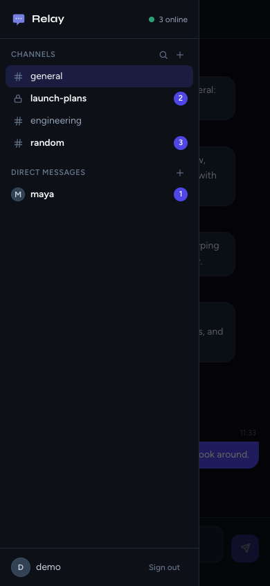

<div align="center">

# Relay

**A full-stack real-time chat app — channels and direct messages, server-side sessions, live Socket.io messaging and PostgreSQL history.**

[](https://github.com/keshavm21/chat-app/actions/workflows/ci.yml)
[](https://nodejs.org)
[](https://react.dev)
[](https://socket.io)
[](https://www.postgresql.org)

[Live Demo](https://chat-app-7wix.onrender.com/) · [Report a Bug](https://github.com/keshavm21/chat-app/issues)

</div>

---

## Try it

Open the [live site](https://chat-app-7wix.onrender.com/) and press **Try the demo**: it signs you in to a shared demo account with a few channels, a private channel and a direct message to explore. Or create your own account, and open a second browser window to chat with yourself in real time. (The free server sleeps when idle, so the first visit can take a little while.)

| Landing | Chat | Mobile |
|:---:|:---:|:---:|
|  |  |  |

---

## Features

- 💬 **Channels and direct messages** — public channels anyone can browse and join, private channels only the people their owner adds can see, and one-to-one DMs with anyone, found by username
- ⚡ **Real-time** — messages, typing indicators and unread counts update live over WebSockets; switching conversations never reconnects
- 🔢 **Reliable order** — every message gets a gapless, per-conversation sequence number inside a database transaction, so everyone sees the same order
- 🔔 **Unread counts** — badges in the sidebar, cleared as you read, kept on the server
- 📜 **History** — the latest messages load first; "Load older" pages back through the rest
- 🔁 **Reconnects** — after a dropped connection the open conversation catches up, without duplicates; a server that briefly could not reach its database is retried until it can
- 🔐 **Server-side sessions** — an httpOnly cookie no script can read, revocable at logout, which also cuts off that session's live connections
- 🛡️ **Security baseline** — conversations you are not in are invisible (404), CSRF defenses (SameSite, Origin checks, JSON-only), rate limits on login, signup, user search and channel creation, password rules, security headers
- 📱 **Responsive** — on a phone the conversation list becomes a drawer

---

## Project Status and Docs

Relay started as a single-room chat and was evolved into **Relay V2** in phases.

| Phase | Status |
|---|---|
| **0 — Foundation:** migrations, TypeScript tooling, integration tests, CI, config validation, error envelope, structured logging, graceful shutdown | ✅ Complete |
| **1 — V2 data model** on a fresh database: channels, DMs and memberships in the schema, gapless per-conversation message order, signup validation | ✅ Complete, in production since 2026-09-27 |
| **2 — Sessions and security baseline:** server-side sessions in an httpOnly cookie, logout that disconnects live sockets, CSRF defenses, rate limits, password rules, helmet, one origin for app and API, verified database TLS | ✅ Complete; released together with Phase 3 |
| **3 — Channels, DMs and launch:** public and private channels, DMs, messaging, typing and unread counts per conversation, the client's sidebar and dialogs, a demo account | ✅ Complete on the `phase-3` branch; release pending |
| 4–8 — REST sends with retries, a change feed, presence, editing, hardening | Not scheduled: the visible parts were built in Phase 3 ([ADR 0006](./docs/adr/0006-reduced-scope-and-socket-send.md)) |

- [Current-state audit](./docs/current-state-audit.md) — the analysis the V2 work starts from
- [V2 design](./docs/v2-design.md) — target architecture, decisions (D1–D17) and the roadmap
- Implementation plans, each with its milestones, decisions and completion record: [Phase 0](./docs/phase-0-implementation-plan.md), [Phase 1](./docs/phase-1-implementation-plan.md) (with the production cutover), [Phase 2](./docs/phase-2-implementation-plan.md), [Phase 3](./docs/phase-3-implementation-plan.md) (with the release runbook)
- [Architecture decision records](./docs/adr/) — the fresh database and migration layout, integer IDs, the per-conversation message sequence, server-side sessions, the one-origin production topology, the reduced scope and socket sends

---

## Tech Stack

| Layer | Technology | Notes |
|---|---|---|
| Frontend | React 19 (Vite), React Router 7 | SPA; chat state in React context and a reducer, no state library |
| Styling | Tailwind CSS v3 | Utility-first; rapid, consistent UI |
| Backend | Node.js + Express 5 | REST API, ESM throughout |
| Real-time | Socket.io 4.x | WebSocket transport only; a room per conversation and per user; the handshake is checked for the session and the origin |
| Auth | Server-side sessions + bcrypt | Random token in an httpOnly cookie, stored only as a SHA-256 hash; checked on every request and socket handshake |
| Security | helmet, express-rate-limit | Security headers; CSRF defenses (SameSite, Origin checks, JSON-only bodies); rate limits |
| Database | PostgreSQL 17 | Neon in production, Docker locally; schema managed by SQL migrations (node-pg-migrate), raw SQL in repositories |
| Validation and errors | zod, one JSON error envelope | The server refuses to start with invalid config; every REST error is `{ error: { code, message } }` |
| Logging | pino + pino-http | JSON logs with cookies and passwords redacted, and the client IP |
| Testing | Vitest + Supertest + socket.io-client; `node --test` | Server integration tests against a real PostgreSQL test database; client unit tests of the chat state rules |
| Tooling | TypeScript (incremental), ESLint, GitHub Actions | CI runs lint, typecheck, tests and build on every push and pull request |
| Deployment | Render | Express serves the API, the socket and the built React app from one origin; Neon hosts PostgreSQL |

---

## Project Structure

```
chat-app/
├── .github/workflows/ci.yml         — CI: lint, typecheck, test, build
├── docker-compose.yml               — local PostgreSQL 17 (relay_dev + relay_test)
├── .env.example                     — server environment variables
├── docs/                            — audit, V2 design, phase plans, ADRs, screenshots
├── client/                          ← React frontend (Vite)
│   ├── vite.config.js               — dev proxy of /api and /socket.io to the server (one origin)
│   ├── vercel.json                  — redirects the old Vercel URL to Render
│   ├── test/                        — unit tests (node --test) of the framework-free modules in src/lib
│   └── src/
│       ├── api/axios.js             — Axios instance (same origin; the cookie goes along)
│       ├── components/chat/         — sidebar, conversation header, message list, composer, dialogs
│       ├── context/                 — AuthProvider (/api/auth/me, logout); ChatProvider (conversations,
│       │                              messages, typing, the socket's lifecycle)
│       ├── lib/                     — chat state rules, name helpers, handshake retry, error messages,
│       │                              the demo account's credentials
│       ├── pages/                   — Landing, Login, Signup, Chat (layout), ChatHome, Conversation
│       ├── socket.js                — Socket.io singleton (WebSocket only, autoConnect: false)
│       └── App.jsx                  — React Router route definitions
└── server/                          ← Express backend
    ├── config/env.ts                — loads .env and validates every variable
    ├── db/                          — PostgreSQL connection pool, withTransaction()
    ├── http/                        — requireSession, requireMember, CSRF checks, rate limits, serving
    │                                  the client, request schemas (zod), JSON 404, the error handler
    ├── lib/                         — sessions, ids, AppError + error codes, shared limits, logger
    ├── migrations/                  — SQL migrations (0001 Phase 0, 0002 V2 schema, 0003 sessions,
    │                                  0004 public channel names)
    ├── repositories/                — SQL for users, conversations, messages and sessions
    ├── routes/                      — auth, conversations, channels, dms, users
    ├── scripts/seedDemo.ts          — npm run seed:demo: the demo account and its channels
    ├── socket/                      — Socket.io handlers and handshake, rooms, the 5-minute session sweep
    ├── test/                        — integration tests
    ├── app.js                       — builds Express + Socket.io (without listening)
    └── index.js                     — starts the server; graceful shutdown
```

---

## Local Setup

All commands start from the repository root.

### Prerequisites

- Node.js 24 (22.18+ also works; CI and Render use 24)
- Docker with Docker Compose, for the local PostgreSQL

### 1. Clone and install

```bash
git clone https://github.com/keshavm21/chat-app.git
cd chat-app

cd server && npm install
cd ../client && npm install
cd ..
```

### 2. Start PostgreSQL

```bash
docker compose up -d --wait
```

This starts PostgreSQL 17 on `localhost:5433` (not 5432, so it doesn't clash with a locally installed PostgreSQL). On first start it creates two databases: `relay_dev` for the app and `relay_test` for the tests. `docker compose down` stops it; `docker compose down -v` also deletes the data.

### 3. Environment variables

```bash
cp .env.example .env
```

The defaults work as they are. `.env.example` documents every variable; its `DATABASE_URL` already points at `relay_dev` (keep `?sslmode=disable` for the local database). The server checks all variables at startup and exits with a message naming any that are missing or invalid.

The client needs no configuration: in development Vite serves it on `http://localhost:5173` and proxies `/api` and `/socket.io` to the server, so the browser sees one origin, as in production.

### 4. Create the schema and the demo data

```bash
cd server
npm run migrate
npm run seed:demo
```

`npm run migrate` applies the SQL migrations in `server/migrations/` to `relay_dev`: `0001` (the Phase 0 schema), `0002` (the V2 schema, which replaces it and creates the `#general` channel), `0003` (sessions) and `0004` (channel names unique among public channels only). Running it again reports that there is nothing to migrate; `npm run migrate:down` rolls back the last migration.

`npm run seed:demo` creates the demo account (`demo@example.com` / `relay-demo`, which the login page's **Try the demo account** fills in), four demo users, `#random`, `#engineering`, a private `#launch-plans` and a DM, each with a short conversation. It only adds what is missing, so running it again changes nothing, and it refuses to run if one of its usernames belongs to someone else.

### 5. Run

```bash
# Terminal 1 — server on http://localhost:5001 (restarts on file changes)
cd server && npm run dev

# Terminal 2 — client on http://localhost:5173 (proxies /api and /socket.io to the server)
cd client && npm run dev
```

Open [http://localhost:5173](http://localhost:5173) and press **Try the demo**. Open a private window and sign up as someone else to chat between the two in real time.

The server logs JSON lines. For readable output, run `npm run dev | npx pino-pretty` instead.

### 6. Tests and checks

```bash
# Server: integration tests (needs the database from step 2), then static checks
cd server && npm test
npm run lint && npm run typecheck && npm run build

# Client: unit tests, then static checks
cd ../client && npm test
npm run lint && npm run typecheck && npm run build
```

The server's `npm test` runs against `relay_test` and applies the migrations itself. It refuses to run against any database that is not a local `*_test` database, so it cannot touch `relay_dev` or production. The client's tests run under Node's own test runner and need nothing else. CI runs the same checks on every push and pull request.

---

## Deployment

Render runs one web service: Express serves the API, the WebSocket and the built React app from one origin, so the session cookie is first-party (see [ADR 0005](./docs/adr/0005-production-cookie-topology.md)). Neon hosts PostgreSQL.

> Production runs Phase 1 until Phases 2 and 3 are released together, from a fresh database, by the [Phase 3 plan, §8](./docs/phase-3-implementation-plan.md#8-release-phases-2-and-3-together); the steps below describe a deployment from scratch.

### Neon — PostgreSQL database

1. Create a project at [neon.tech](https://neon.tech) and copy its **direct** (not pooled) connection string. Change its `sslmode=require` to **`sslmode=verify-full`** (keep `channel_binding=require`): the server refuses to start with any other `sslmode` for a database that is not local, so the connection always checks the certificate and host name.
2. Create the schema and the demo data by running the migrations and the seed against it once, from your machine:

   ```bash
   cd server
   DATABASE_URL='<neon connection string>' npm run migrate
   DATABASE_URL='<neon connection string>' npm run seed:demo
   ```

3. Use the same connection string as `DATABASE_URL` on Render (below).

### Render — the app

1. In [Render](https://render.com): **New** → **Web Service** → connect the GitHub repo.
2. Leave the **Root Directory** empty (the repository root): the service builds both projects.
3. Build command:

   ```bash
   npm ci --include=dev --prefix client && npm run build --prefix client && npm ci --include=dev --prefix server && npm run build --prefix server
   ```

   Start command: `npm start --prefix server`. Both installs need `--include=dev`: Render runs the build with the service's `NODE_ENV=production`, which makes `npm ci` skip dev dependencies, and both builds use them (Vite for the client, TypeScript for the server).
4. Add environment variables in the Render dashboard:

   | Variable | Value |
   |---|---|
   | `DATABASE_URL` | the Neon connection string, with `sslmode=verify-full` |
   | `CLIENT_URL` | the service's own URL, e.g. `https://chat-app-7wix.onrender.com`: the only origin allowed to change state or open a socket |
   | `NODE_ENV` | `production`: the session cookie becomes `__Host-relay_session` with `Secure` |
   | `TRUST_PROXY` | `1`: Render's proxy adds the client IP to `X-Forwarded-For`, which the rate limits and logs use |
   | `LOG_LEVEL` | optional; defaults to `info` |

   Render sets `PORT` itself. If a variable is missing or invalid, the server exits at startup and the log names it.
5. After the first deploy, check `TRUST_PROXY`: the request log lines' `ip` should be your public IP, also when you send a request with `X-Forwarded-For: 1.2.3.4`.

On every deploy Render sends the old instance `SIGTERM`. The server shuts down gracefully, and connected clients reconnect to the new instance automatically. On Render's free tier the instance sleeps when idle, so the first visit after a while waits for it to wake up.

### The old Vercel URL

The client used to be deployed on Vercel. `client/vercel.json` now redirects every path of that project to the same path on Render (a temporary 307 for now), so old links keep working.

---

---

## How It Works

### Authentication

1. Signup validates the username, email and password (8+ characters, at most 72 bytes: bcrypt's limit), stores the username and email lowercase and the password as a bcrypt hash, and adds the user to `#general`.
2. Signup and login each start a **server-side session**: a random 32-byte token goes into an `HttpOnly`, `SameSite=Lax` cookie, and the database stores only its SHA-256 hash. JavaScript never sees the token; the app asks `GET /api/auth/me` who is logged in.
3. Every protected request and every socket handshake looks the session up. A session ends 30 days after login, after 7 days unused, or at logout.
4. Logout deletes that session and disconnects its live sockets at once; the user's other devices stay logged in. Every 5 minutes, a sweep disconnects the sockets of sessions that expired or were deleted.
5. Brute force is limited: 10 failed logins per 15 minutes per IP and email, 20 signups per hour per IP. Login takes as long for an unknown email as for a wrong password, so it does not reveal who has an account.

### Cross-site protection

A page on another site cannot act as the user: the cookie is `SameSite=Lax`; every state-changing request must carry the app's own `Origin` and a JSON body; the WebSocket handshake is refused from any other origin; and there is no CORS, so no other site can read a response. See [ADR 0004](./docs/adr/0004-server-side-sessions.md).

### Conversations and membership

Channels (public or private) and DMs live in one `conversations` table, with a `conversation_members` row per member. Reading a conversation needs membership, and a conversation you are not in answers 404 whether it exists or not, so a private channel's existence never leaks. Anyone can join a public channel; only a private channel's owner adds people; a DM is created once per pair, even when both people start it at the same moment (`INSERT … ON CONFLICT` on the pair).

### Real-time messaging

1. On connecting, each socket joins a room for its user and one for each of its conversations, so a conversation's messages and typing reach its members only. Joining, leaving or being added moves all of a user's open tabs between rooms at once.
2. The user sends a message → the client emits `new_message { conversationId, content }`.
3. In one database transaction, the server takes the conversation's next sequence number (`seq`) and stores the message if the sender is a member. Locking the conversation's row makes the numbers gapless and puts them in commit order, and a failed send uses none up ([ADR 0003](./docs/adr/0003-per-conversation-sequence.md)).
4. After the commit, the server sends the complete message, including its `seq`, to the conversation's room. Every member's tab adds it, and the others' unread counts go up.
5. History comes from `GET /api/conversations/:id/messages`, the latest 50 by `seq`, then older pages on "Load older". After a reconnect the open conversation reloads its latest page and merges it by message id: nothing is missed or shown twice.

### Unread counts

Each conversation counts its messages (`last_seq`), and each membership remembers how far its user has read (`last_read_seq`): the unread count is the difference, without counting rows. Opening a conversation moves your read position forward (it never moves back), and your own messages count as read.

### Typing indicators

1. The client emits `typing { conversationId }` at most once a second while you type.
2. The server tells the conversation's other members once per burst, and clears the indicator after 3 seconds of silence, when you send, or when you disconnect.
